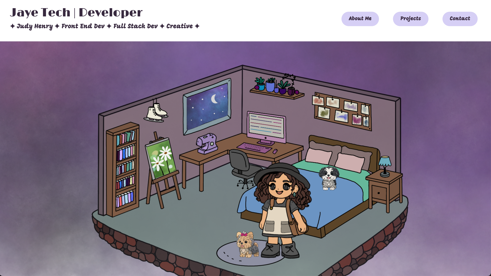

# 🌐 jayetech.dev

Personal portfolio website for **Judy Henry** showcasing projects, experiments, and creative development work.

The site is built using **HTML, CSS, and JavaScript** with custom visual assets and interactive design elements.

This project serves as both a **personal website** and a **playground for creative web development**.

---

# 🚀 Live Website

🌎 **https://jayetech.dev**




---

# 📁 Project Structure

```
jayetech
├── index.html
├── about.html
├── project.html
├── prompt.html
├── css/
├── js/
├── assets/
```

---

# 🛠 Technologies

- HTML5
- CSS3
- JavaScript
- Vercel (deployment)

---

# 💡 Purpose

This website was created to serve as a central place to share:

- software development projects
- experimental ideas and prompts
- creative design work
- interactive web experiments

The goal is to combine **technical development with creative expression**.

---

# 📦 Deployment

The site is deployed using **Vercel**.

---

# 👩‍💻 Author

**Judy Henry**  